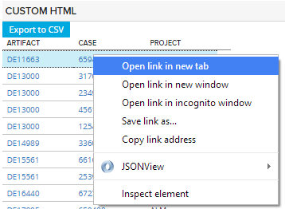
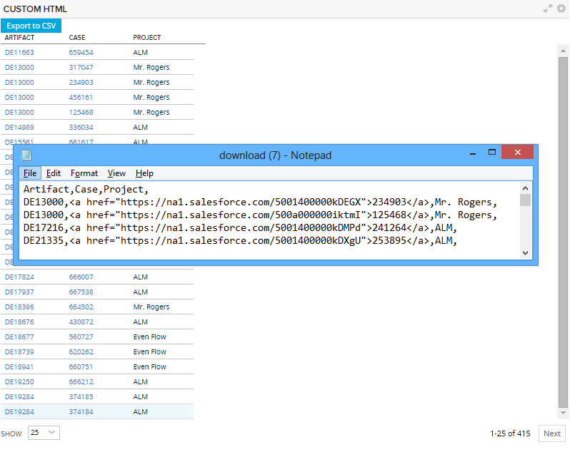
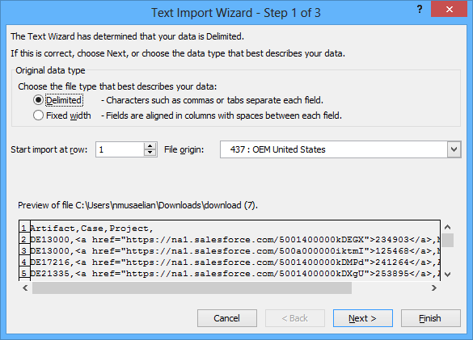
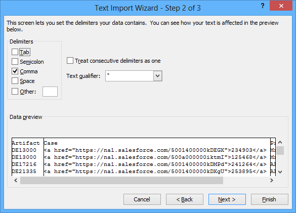
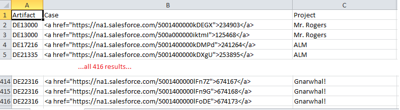

salesforce cases
=========================

## Overview
To link to Salseforce case use right click:

To export to CSV click on Export button. The view shows the CSV file opened in a text editor:

Open the CSV file in Excel:

The view in Excel:

NOTE: The app was tested with Chrome Version 37.0.2062.103 m and Firefox 32
It will not work with older versions of IE.
It is expected to work in IE10 after an AppSDK2rc3 defect in IE10 is fixed (expected to be released the week of September 8)

## License
This app is vailable AS IS. It is NOT supported by Rally.
AppTemplate is released under the MIT license.  See the file [LICENSE](./LICENSE) for the full text.

##Documentation for SDK

You can find the documentation on our help [site.](https://help.rallydev.com/apps/2.0rc3/doc/)
